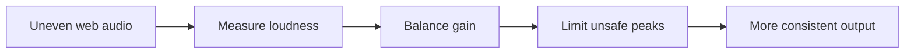

<p align="center">
  <picture>
    <source media="(prefers-color-scheme: dark)" srcset="assets/logo-ai-a-dark.png">
    
  </picture>
</p>

<h1 align="center">LoudEase</h1>

<p align="center"><strong>Smooth the jumps. Keep the detail. Stay in control.</strong></p>

<p align="center">
  LoudEase makes web audio more comfortable by calming sudden loudness and carefully lifting quiet detail.<br>
  Player volume and mute always remain authoritative.
</p>

<p align="center">
  <a href="https://github.com/WSL043/loudease/actions/workflows/ci.yml"></a>
  
  
  
  <a href="LICENSE"></a>
</p>

<p align="center">
  <a href="README_zh.md">简体中文</a> ·
  <a href="#install-the-private-beta">Install</a> ·
  <a href="#how-it-works">How it works</a> ·
  <a href="#help-shape-loudease">Community testing</a> ·
  <a href="CONTRIBUTING.md">Contribute</a>
</p>

<p align="center">
  <picture>
    <source media="(prefers-color-scheme: dark)" srcset="docs/popup-screenshot-dark.png">
    
  </picture>
</p>

> [!NOTE]
> LoudEase is currently a private beta. Compatibility statements below distinguish verified behavior from community test targets.

## A calmer listening range

Web audio rarely agrees on one comfortable level. Dialogue disappears, effects jump out, ads arrive hot, and the next creator or stream can sound completely different. A normal volume slider moves everything together; LoudEase works on the difference between moments.

| Calm sudden loudness | Recover quiet detail | Respect your controls |
|---|---|---|
| Fast gain reduction and a look-ahead limiter catch uncomfortable jumps and short peaks. | Quiet lift is restrained by signal confidence, available headroom, and the selected strength. | Mute and zero player volume are hard boundaries. The UI only says **active** when fresh runtime evidence exists. |

LoudEase is not a volume booster, an equalizer, or a calibrated hearing-protection device. It narrows disruptive level differences while preserving useful dynamics.

## How it works



The authorized tab is captured as one audio stream, then processed locally in an `AudioWorklet`. K-weighted measurements guide separate loud-cut and quiet-lift policies; a look-ahead limiter protects peak headroom. No raw audio is uploaded.

For implementation details, assumptions, and current gaps, read [Audio DSP](docs/AUDIO_DSP.md), [Architecture](docs/ARCHITECTURE.md), and [Known limitations](docs/KNOWN_LIMITATIONS.md).

## Install the private beta

Requirements: Chrome 116+ and Node.js 20+.

```bash
git clone https://github.com/WSL043/loudease.git
cd loudease
npm install
npm run build:dev
```

Open `chrome://extensions`, enable **Developer mode**, choose **Load unpacked**, and select `dist/github-dev`.

1. Open a normal `http` or `https` tab that is playing audio.
2. Click LoudEase once to authorize that tab.
3. A moving waveform and a current dB value confirm live processing.
4. Adjust **Reduce loud sounds** and **Lift quiet sounds** only when the defaults do not fit.

Chrome requires a user gesture before `tabCapture` starts. A completely new tab cannot be captured silently; after authorization, LoudEase can keep processing while you switch to another tab.

## Verified scope

| Evidence | Current scope |
|---|---|
| Private beta baseline | YouTube video/live, Bilibili video/live, Douyin video/live |
| Automated regression | HTML5 media, SPA source replacement, iframes, Web Audio, mute, zero player volume, slider persistence, and offline DSP graphs |
| Community test targets | Twitch, TikTok, Spotify Web Player, Vimeo, social video, regional services, and protected streaming |

Test targets are not compatibility promises. Chrome internal pages and surfaces Chrome refuses to capture are unsupported. See [Site adapters](docs/SITE_ADAPTERS.md) and the [Test matrix](docs/TEST_MATRIX.md).

The interface currently includes Arabic, German, English, Spanish, French, Japanese, Korean, Brazilian Portuguese, Russian, Simplified Chinese, and Traditional Chinese. English is the default.

## Help shape LoudEase

No single tester needs to cover every platform or run a two-hour endurance session. Small, reproducible checks are more useful:

- spend 10 minutes checking one site, source switch, mute, player volume, and tab switching;
- compare one dialogue, music, live, or transient-heavy sample with LoudEase on and off;
- review one translation in a language you use daily;
- contribute one focused fix with a regression test.

Start with the [community testing guide](docs/COMMUNITY_TESTING.md), then use the [issue chooser](https://github.com/WSL043/loudease/issues/new/choose) for compatibility, audio-quality, bug, or product feedback. Reports are voluntary and user-initiated; LoudEase contains no automatic telemetry service.

<details>
<summary><strong>Current settings and per-site controls</strong></summary>
<br>
<p align="center">
  <picture>
    <source media="(prefers-color-scheme: dark)" srcset="docs/settings-screenshot-dark.png">
    
  </picture>
</p>
</details>

## Build and verify

```bash
npm test              # contracts, DSP tests, and offline audio graphs
npm run test:dsp      # focused DSP verification
npm run test:slider   # popup persistence regression
npm run test:release  # stripped Chrome Web Store package
npm run audit         # release-readiness evidence audit
```

`dist/github-dev` keeps contributor diagnostics available but off by default. `dist/store` removes localhost permissions, diagnostic UI, symbols, and network code through an allowlist build. Read [Build and release](docs/BUILD.md) before changing permissions or packaging.

Open beta and store gates are tracked in the evidence-based [Release readiness review](docs/RELEASE_READINESS_REVIEW.md).

## Privacy, safety, and license

- Audio stays inside the local extension audio graph.
- There is no advertising analytics, silent telemetry, or remote executable code.
- Settings use `chrome.storage.sync`, subject to the user's Chrome Sync configuration.
- LoudEase cannot control operating-system gain, hardware amplification, or acoustic output at the ear.

See [Privacy](PRIVACY.md), [Feedback and data boundaries](docs/FEEDBACK.md), and [Security](SECURITY.md).

Source code is licensed under [MPL-2.0](LICENSE). Modified LoudEase source files remain open when distributed; separate files in a larger work may use their own license. The LoudEase name and logo are governed separately by the [Trademark Policy](TRADEMARKS.md).
