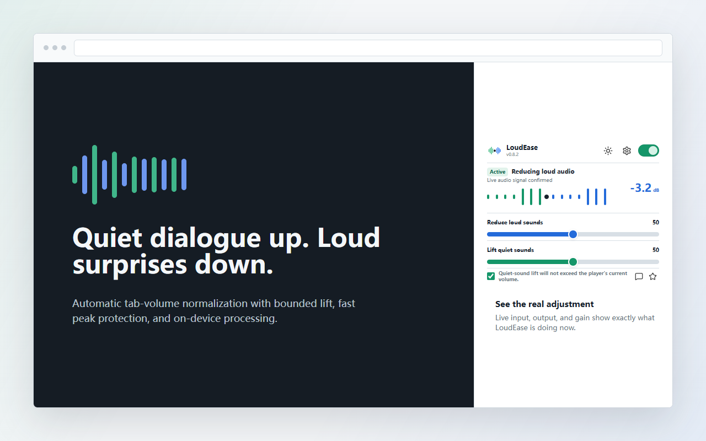
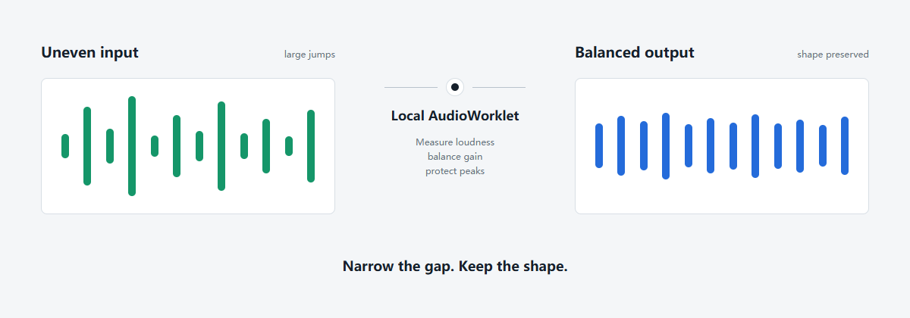

<p align="center">
  <picture>
    <source media="(prefers-color-scheme: dark)" srcset="assets/logo-ai-a-dark.png">
    
  </picture>
</p>

<h1 align="center">LoudEase</h1>

<p align="center"><strong>Smooth the jumps. Keep the detail. Stay in control.</strong></p>

<p align="center">
  LoudEase makes web audio more comfortable by calming sudden loudness and bringing genuine quiet passages closer.<br>
  Player volume and mute always remain authoritative.
</p>

<p align="center">
  <a href="https://github.com/WSL043/loudease/actions/workflows/ci.yml"></a>
  
  
  
  <a href="LICENSE"></a>
</p>

<p align="center">
  <a href="README_zh.md">简体中文</a> ·
  <a href="#install">Install</a> ·
  <a href="#how-it-works">How it works</a> ·
  <a href="#help-shape-loudease">Community testing</a> ·
  <a href="CONTRIBUTING.md">Contribute</a> ·
  <a href="SUPPORT.md">Support</a>
</p>

<p align="center">
  
</p>

> [!NOTE]
> LoudEase is currently a private beta. Compatibility statements below distinguish verified behavior from community test targets.

## A calmer listening range

Web audio rarely agrees on one comfortable level. Dialogue disappears, effects jump out, ads arrive hot, and the next creator or stream can sound completely different. A normal volume slider moves everything together; LoudEase works on the difference between moments.

| Calm sudden loudness | Recover quiet detail | Respect your controls |
|---|---|---|
| Fast gain reduction and a look-ahead limiter catch uncomfortable jumps and short peaks. | A programme baseline lifts sources that are quiet overall; clearly audible within-programme detail gets at most 16 dB extra lift, while near-silence is not chased. | Mute and zero player volume are hard boundaries. The UI only says **active** when fresh runtime evidence exists. |

LoudEase is not a simple volume booster, an equalizer, or a calibrated hearing-protection device. It narrows disruptive level differences with a strength-scaled, bounded peak-compression budget.

## How it works

<p align="center">
  
</p>

The authorized tab is captured as one audio stream, then processed locally in an `AudioWorklet`. K-weighted gated measurement establishes a stable programme baseline, a floor-qualified 16 dB detail term handles clearly audible quiet passages, and independent fast protection plus a 5 ms look-ahead limiter catch loud onsets. Transient blob or `srcObject` replacement inside one page does not reset the programme. Upward lift still waits for representative signal, but now reaches full confidence after about 1.5 seconds of continuous accepted audio so short quiet videos are not left behind. No raw audio is uploaded.

For implementation details, assumptions, and current gaps, read [Audio DSP](docs/AUDIO_DSP.md), [Architecture](docs/ARCHITECTURE.md), and [Known limitations](docs/KNOWN_LIMITATIONS.md).

## One audio core, two distributions

| Chrome Web Store build | GitHub development build |
|---|---|
| The same DSP, popup, settings, languages, and per-site rules. Localhost diagnostics and contributor-only controls are physically removed from the package. | The complete open-source project, including opt-in local diagnostics, test pages, evidence tools, and reproducible store packaging. |

The store build is smaller for privacy and review compliance; it does not use a weaker balancing algorithm. Trusted `dist/github-dev` builds additionally contain a maintainer auto-protection mode: when Chrome starts with LoudEase's exact extension ID allowlisted, maintained YouTube, Bilibili, and Douyin tabs—and new tabs opened by an already protected tab—can be captured before playback. It installs no native helper and reuses the same DSP. The store build physically removes this path. Public GitHub Releases still attach the stripped store ZIP; `dist/github-dev` is not an ordinary public installation artifact.

## Install

Ordinary users install the future public release from the Chrome Web Store and need only Chrome 116 or newer. They do not need Node.js, a server, or a database.

### Manual beta sideload for trusted testers

This Developer-mode route is for testing trusted code, not normal public distribution.

1. Download the verified `loudease-store.zip` from the selected GitHub prerelease and extract it to a permanent folder.
2. Open `chrome://extensions` and enable **Developer mode**.
3. Choose **Load unpacked** and select the extracted directory containing `manifest.json`.

Updates are manual: replace the files in the same directory with the next verified ZIP, click the extension's **Reload** button, and reload affected web pages. Managed Chrome installations may block Developer mode or unpacked extensions.

### Build from source

Contributors need Node.js 20 or newer:

```bash
git clone https://github.com/WSL043/loudease.git
cd loudease
npm run build:dev
```

Open `chrome://extensions`, enable **Developer mode**, choose **Load unpacked**, and select `dist/github-dev`.

1. Open a normal `http` or `https` tab that is playing audio.
2. Click LoudEase once to authorize that tab.
3. A moving waveform and a current dB value confirm live processing.
4. Adjust **Reduce loud sounds** and **Lift quiet sounds** only when the defaults do not fit.

The public store runtime requires a user gesture before `tabCapture` starts. A completely new store tab cannot be captured silently; after authorization, LoudEase can keep processing while you switch to another tab.

Maintainers can use the [trusted GitHub automatic-protection workflow](docs/INSTALLATION.md#trusted-github-automatic-protection). On Windows, double-click `Enable-LoudEase-AutoProtection.cmd` in the source tree to update the current-user Chrome shortcuts once; it installs no resident process and supports `-Disable`. This is not a Web Store feature, and Chrome must be fully restarted from an updated shortcut.

LoudEase does not publish a Tampermonkey, Violentmonkey, or Greasy Fork core edition. A userscript cannot access the extension-only `chrome.tabCapture` and offscreen-document pipeline or the complete tab mix, so it would reintroduce iframe, Web Audio, protected-player, and pre-play gaps. A non-audio site-UI companion would only be considered if it later has a distinct use case.

See [Installation](docs/INSTALLATION.md) for the store, packaged-beta, and source-development paths.

## Verified scope

| Evidence | Current scope |
|---|---|
| Private beta baseline | YouTube video/live, Bilibili video/live, Douyin video/live |
| Automated regression | HTML5 media, SPA source replacement, iframes, Web Audio, mute, zero player volume, slider persistence, and offline DSP graphs |
| Community test targets | Twitch, TikTok, Spotify Web Player, Vimeo, social video, regional services, and protected streaming |

Test targets are not compatibility promises. Chrome internal pages and surfaces Chrome refuses to capture are unsupported. See [Site adapters](docs/SITE_ADAPTERS.md) and the [Test matrix](docs/TEST_MATRIX.md).

The interface currently includes Arabic, German, English, Spanish, French, Japanese, Korean, Brazilian Portuguese, Russian, Simplified Chinese, and Traditional Chinese. English is the default.

## Help shape LoudEase

No single tester needs to cover every platform or run a two-hour endurance session. Small, reproducible checks are more useful:

- spend 10 minutes checking one site, source switch, mute, player volume, and tab switching;
- compare one dialogue, music, live, or transient-heavy sample with LoudEase on and off;
- review one translation in a language you use daily;
- contribute one focused fix with a regression test.

Start with the [community testing guide](docs/COMMUNITY_TESTING.md), then use the [issue chooser](https://github.com/WSL043/loudease/issues/new/choose) for compatibility, audio-quality, bug, or product feedback. Reports are voluntary and user-initiated; LoudEase contains no automatic telemetry service.

WSL043 maintains the official project. Use [Support](SUPPORT.md) and the GitHub Issue Forms for reports and proposals; [Governance](GOVERNANCE.md) defines the project boundary.

<details>
<summary><strong>Current settings and per-site controls</strong></summary>
<br>
<p align="center">
  <picture>
    <source media="(prefers-color-scheme: dark)" srcset="docs/settings-screenshot-dark.png">
    
  </picture>
</p>
</details>

## Build and verify

```bash
npm test              # contracts, DSP tests, and offline audio graphs
npm run test:dsp      # focused DSP verification
npm run test:silent   # isolated live capture with no system audio output
npm run test:capture  # silent local loud/lift/mute/player-volume/burst matrix
npm run test:auto-capture # GitHub pre-play and new-tab automatic capture
npm run test:sites    # silent YouTube/Bilibili/Douyin video/live matrix
npm run test:long     # configurable isolated stability/endurance run
npm run test:slider   # popup persistence regression
npm run test:release  # stripped Chrome Web Store package
npm run audit         # release-readiness evidence audit
```

`dist/github-dev` keeps contributor diagnostics available but off by default. `dist/store` removes localhost permissions, diagnostic UI, symbols, and network code through an allowlist build. Read [Build](docs/BUILD.md), [Publishing](docs/PUBLISHING.md), and [AGENTS.md](AGENTS.md) before changing permissions, packaging, or release state.

Open beta and store gates are tracked in the evidence-based [Release readiness review](docs/RELEASE_READINESS_REVIEW.md).

## Privacy, safety, and license

- Audio stays inside the local extension audio graph.
- There is no advertising, analytics, silent telemetry, or remote executable code.
- Settings use `chrome.storage.sync`, subject to the user's Chrome Sync configuration.
- LoudEase cannot control operating-system gain, hardware amplification, or acoustic output at the ear.

See [Privacy](PRIVACY.md), [Feedback and data boundaries](docs/FEEDBACK.md), and [Security](SECURITY.md).

Source code is licensed under [GPL-3.0-only](LICENSE). Distributed derivative versions must provide the corresponding source under GPLv3. Copies previously distributed under historical Beta tags retain the license grants attached to those copies, even if a prerelease or tag is later removed from GitHub. The LoudEase name and logo are governed separately by the [Trademark Policy](TRADEMARKS.md); bundled icon notices are recorded in [Third-party notices](THIRD_PARTY_NOTICES.md).

The decision and transition boundary are explained in [Licensing](docs/LICENSING.md). Project authority and contribution rights are documented in [Governance](GOVERNANCE.md), [Contributing](CONTRIBUTING.md), and the [Developer Certificate of Origin](DCO). Asset origins and machine-readable license boundaries are recorded in [Asset provenance](ASSET_PROVENANCE.md) and [REUSE.toml](REUSE.toml).
