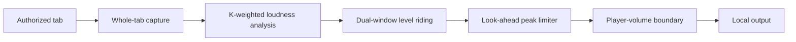

<p align="center">
  <picture>
    <source media="(prefers-color-scheme: dark)" srcset="assets/logo-ai-a-dark.png">
    
  </picture>
</p>

<h1 align="center">LoudEase</h1>

<p align="center"><strong>Make the web easier on your ears.</strong></p>

<p align="center">
  LoudEase smooths sudden loud moments and gently reveals quiet detail,<br>
  while keeping the player volume and mute controls in charge.
</p>

<p align="center">
  <a href="https://github.com/WSL043/loudease/actions/workflows/ci.yml"></a>
  
  
  
  <a href="LICENSE"></a>
</p>

<p align="center">
  <a href="README_zh.md">简体中文</a> ·
  <a href="#try-the-beta">Try it</a> ·
  <a href="docs/AUDIO_DSP.md">Audio design</a> ·
  <a href="docs/ARCHITECTURE.md">Architecture</a> ·
  <a href="docs/RELEASE_READINESS_REVIEW.md">Release status</a> ·
  <a href="CONTRIBUTING.md">Contribute</a>
</p>

<p align="center">
  <picture>
    <source media="(prefers-color-scheme: dark)" srcset="docs/popup-screenshot-dark.png">
    
  </picture>
</p>

## One comfortable listening range

Web audio is inconsistent. Dialogue can be hard to hear, effects can arrive much louder, and switching creators or streams often means reaching for the volume control again.

LoudEase is not a volume booster and it is not an EQ. It is a local loudness controller built around three rules:

| | What LoudEase does |
|---|---|
| **Calm loud moments** | Reduces sustained loudness quickly and catches short peaks with a look-ahead limiter. |
| **Reveal quiet detail** | Adds restrained gain only when real signal and peak headroom make it safe. |
| **Respect your controls** | Player mute and zero volume remain hard boundaries; the UI only claims processing when fresh runtime evidence exists. |

The result is a narrower, more comfortable loudness range without forcing every moment into a flat wall of sound.

## Built for audio, not a volume slider



- Whole-tab capture covers media elements, live streams, and Web Audio inside an authorized tab.
- AudioWorklet processing keeps the real-time control loop off the page and service-worker threads.
- Separate loud-cut and quiet-lift policies avoid treating every signal as the same problem.
- Processing is local. Raw audio is not uploaded or used for analytics.

Read the exact algorithm, constants, and known gaps in [Audio DSP](docs/AUDIO_DSP.md).

## Try the beta

Requirements: Chrome 116+ and Node.js 20+.

```bash
git clone https://github.com/WSL043/loudease.git
cd loudease
npm install
npm run build:dev
```

Open `chrome://extensions`, enable **Developer mode**, choose **Load unpacked**, and select `dist/github-dev`.

1. Open a normal `http` or `https` tab that is playing audio.
2. Click LoudEase once to authorize that tab.
3. Look for a live waveform and a current dB adjustment.
4. Tune **Reduce loud sounds** or **Lift quiet sounds** only if the defaults do not fit.

Chrome requires a user gesture before `tabCapture` starts. A completely new tab cannot be captured silently; this is a browser security boundary, not a missing site adapter.

## Compatibility

| Evidence level | Current scope |
|---|---|
| Beta baseline | YouTube video/live, Bilibili video/live, Douyin video/live |
| Local regression suite | HTML5 media, SPA source replacement, iframes, Web Audio, mute and player-volume boundaries |
| Expansion matrix | Twitch, TikTok, Spotify Web Player, Vimeo, social video, regional services, protected streaming |

Expansion entries are test targets, not compatibility claims. Chrome internal pages and surfaces Chrome refuses to capture are unsupported. See [site compatibility](docs/SITE_ADAPTERS.md), [known limitations](docs/KNOWN_LIMITATIONS.md), and the [test matrix](docs/TEST_MATRIX.md).

The interface ships in Arabic, German, English, Spanish, French, Japanese, Korean, Brazilian Portuguese, Russian, Simplified Chinese, and Traditional Chinese. English is the default.

<details>
<summary><strong>Settings and per-site controls</strong></summary>
<br>
<p align="center">
  
</p>
</details>

## Build and verify

```bash
npm test              # static contracts, DSP tests, and offline audio graphs
npm run test:dsp      # focused DSP verification
npm run test:slider   # popup persistence regression
npm run test:release  # stripped Chrome Web Store package
npm run audit         # release-readiness evidence audit
```

`dist/github-dev` keeps contributor diagnostics available but off by default. `dist/store` removes localhost permissions, diagnostic UI, symbols, and network code through an allowlist build. Read [Build and release](docs/BUILD.md) before changing permissions or packaging.

## Privacy and safety

- Audio samples stay in the local extension audio graph.
- There is no advertising analytics or remote executable code.
- Settings use `chrome.storage.sync`, subject to the user's Chrome Sync configuration.
- LoudEase is not a calibrated hearing-protection device and cannot control operating-system gain, hardware amplification, or acoustic output at the ear.

See [Privacy](PRIVACY.md), [Feedback and data boundaries](docs/FEEDBACK.md), and [Security](SECURITY.md).

## Contributing

Issues and focused pull requests are welcome. DSP changes need reproducible fixtures, output-peak evidence, gain-envelope checks, and listening notes. Permission, capture, storage, or network changes require an explicit privacy review.

Start with [Contributing](CONTRIBUTING.md). Report vulnerabilities through GitHub Security Advisories, not public issues.

## License

LoudEase source code is released under the [Mozilla Public License 2.0](LICENSE). Modified LoudEase source files remain open when distributed; larger works may use their own license for separate files.

The LoudEase name and logo are not licensed with the source code. Forks are welcome, but redistributed products must use a distinct name and visual identity. See [Trademark Policy](TRADEMARKS.md) and [NOTICE](NOTICE).
