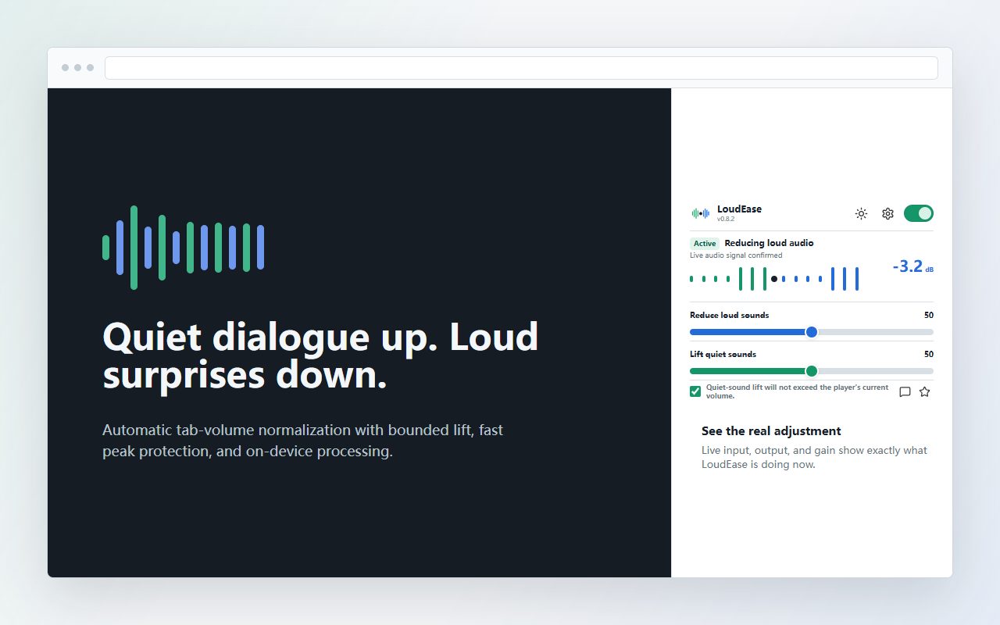
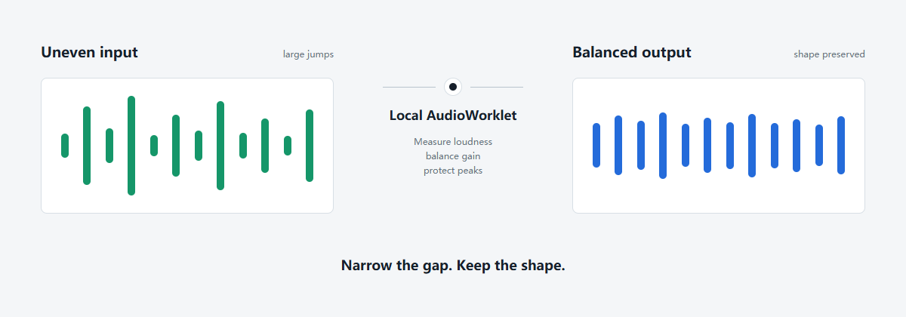
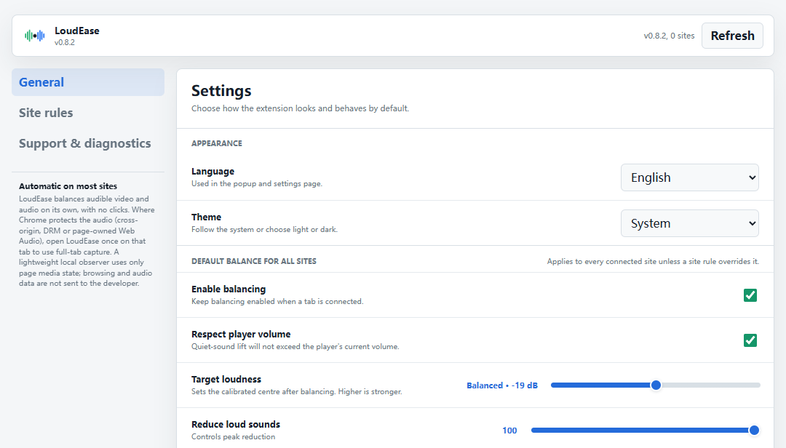

<p align="center">
  <picture>
    <source media="(prefers-color-scheme: dark)" srcset="assets/logo-ai-a-dark.png">
    
  </picture>
</p>

<h1 align="center">LoudEase</h1>

<p align="center"><strong>Automatic volume normalizer for Chrome — loud ads and sudden peaks down, quiet dialogue up. No clicks.</strong></p>

<p align="center">
  Install it and forget it. LoudEase evens out video and audio volume on the sites you watch,<br>
  so you stop reaching for the volume control. Processing stays on your device, and player volume and mute stay yours.
</p>

<p align="center">
  <a href="https://chromewebstore.google.com/detail/gdkaclfjhmenjhoemdkjlpafdhengjog?utm_source=github&amp;utm_medium=referral&amp;utm_campaign=readme-en"><strong>Install LoudEase from the Chrome Web Store</strong></a>
</p>

<p align="center">
  If LoudEase helps, leave an <a href="https://chromewebstore.google.com/detail/loudease/gdkaclfjhmenjhoemdkjlpafdhengjog/reviews">honest store review</a> or <a href="https://github.com/WSL043/loudease">star the project on GitHub</a>.
</p>

<p align="center">
  <a href="https://github.com/WSL043/loudease/actions/workflows/ci.yml"></a>
  
  
  
  <a href="LICENSE"></a>
</p>

<p align="center">
  <a href="README_zh.md">简体中文</a> ·
  <a href="#install">Install</a> ·
  <a href="#how-it-works">How it works</a> ·
  <a href="#help-shape-loudease">Community testing</a> ·
  <a href="CONTRIBUTING.md">Contribute</a> ·
  <a href="SUPPORT.md">Support</a>
</p>

<p align="center">
  
</p>

> [!NOTE]
> LoudEase is publicly available as a beta. Compatibility statements below distinguish verified behavior from community test targets.

## What it fixes

- **Loud ads and jump scares** that arrive 10 dB hotter than the video you were watching.
- **Whispered dialogue** you have to crank up, right before an explosion you then have to turn down.
- **Creator-to-creator differences**: one channel is quiet, the next is blasting.
- **Late-night listening** where you want a narrower range without turning everything into mush.

It works automatically on video and audio elements in ordinary web pages (verified today on YouTube and Bilibili); nothing to click per tab. For sites where Chrome protects the audio, one click on that tab switches to full-tab capture.

| | LoudEase | Typical volume booster | Typical fixed compressor |
|---|---|---|---|
| Adapts to each video and ad | Yes, measures programme loudness | No, one gain for everything | Partly, fixed threshold |
| Lifts quiet sources | Bounded, confidence-gated lift | Boosts everything, including peaks | Makeup gain only |
| Protects against sudden peaks | 5 ms look-ahead limiter | Often clips | Depends on settings |
| Respects mute and player volume | Hard boundary | Usually not | Usually not |
| Needs per-tab clicks | No (automatic) | Often | Often |
| Audio leaves your device | Never | Varies | Varies |

## A calmer listening range

Web audio rarely agrees on one comfortable level. Dialogue disappears, effects jump out, ads arrive hot, and the next creator or stream can sound completely different. A normal volume slider moves everything together; LoudEase works on the difference between moments.

Use the website player or operating-system volume to choose the overall listening level. The two LoudEase controls only set how strongly loud passages are reduced and quiet detail is lifted. LoudEase intentionally does not add a separate master-volume slider: moving every sound together would duplicate existing volume controls without improving source-to-source balance.

| Calm sudden loudness | Recover quiet detail | Respect your controls |
|---|---|---|
| Fast gain reduction and a look-ahead limiter catch uncomfortable jumps and short peaks. | A programme baseline lifts sources that are quiet overall; clearly audible within-programme detail gets at most 16 dB extra lift, while near-silence is not chased. | Mute and zero player volume are hard boundaries. The UI only says **active** when fresh runtime evidence exists. |

LoudEase is not a simple volume booster, an equalizer, or a calibrated hearing-protection device. It narrows disruptive level differences with a strength-scaled, bounded peak-compression budget.

## How it works

<p align="center">
  
</p>

Eligible audible media is routed through a local `AudioWorklet` automatically; when Chrome protects the audio, the authorized tab is captured as one audio stream and processed by the same worklet. K-weighted gated measurement establishes a stable programme baseline, a floor-qualified 16 dB detail term handles clearly audible quiet passages, and independent fast protection plus a 5 ms look-ahead limiter catch loud onsets. Transient blob or `srcObject` replacement inside one page does not reset the programme. Upward lift still waits for representative signal, but now reaches full confidence after about 1.5 seconds of continuous accepted audio so short quiet videos are not left behind. No raw audio is uploaded.

For implementation details, assumptions, and current gaps, read [Audio DSP](docs/AUDIO_DSP.md), [Architecture](docs/ARCHITECTURE.md), and [Known limitations](docs/KNOWN_LIMITATIONS.md).

## One audio core, two entry points, two distributions

LoudEase attaches to audible video and audio elements on its own (automatic mode). Media that Chrome would silence when routed through Web Audio — cross-origin media without CORS, DRM streams, and pages that build their own audio graph — is never touched by automatic mode; there, opening LoudEase once on the tab uses full-tab capture instead. Both use the identical DSP.


| Chrome Web Store build | GitHub development build |
|---|---|
| The same DSP, popup, settings, languages, and per-site rules. Localhost diagnostics and contributor-only controls are physically removed from the package. | The complete open-source project, including opt-in local diagnostics, test pages, evidence tools, and reproducible store packaging. |

The store build is smaller for privacy and review compliance; it does not use a weaker balancing algorithm. `dist/github-dev` only adds contributor diagnostics and test controls. Both builds use Chrome's standard user-invoked `tabCapture` flow and never modify Chrome startup shortcuts. Public GitHub Releases attach the stripped store ZIP; `dist/github-dev` is not an ordinary public installation artifact.

## Install

Ordinary users install LoudEase from the [Chrome Web Store](https://chromewebstore.google.com/detail/gdkaclfjhmenjhoemdkjlpafdhengjog?utm_source=github&utm_medium=referral&utm_campaign=readme-en) and need only Chrome 116 or newer. They do not need Node.js, a server, or a database.

### Manual beta sideload for trusted testers

This Developer-mode route is for testing trusted code, not normal public distribution.

1. Download the verified `loudease-store.zip` from the selected GitHub prerelease and extract it to a permanent folder.
2. Open `chrome://extensions` and enable **Developer mode**.
3. Choose **Load unpacked** and select the extracted directory containing `manifest.json`.

Updates are manual: replace the files in the same directory with the next verified ZIP, click the extension's **Reload** button, and reload affected web pages. Managed Chrome installations may block Developer mode or unpacked extensions.

### Build from source

Contributors need Node.js 20 or newer:

```bash
git clone https://github.com/WSL043/loudease.git
cd loudease
npm run build:dev
```

Open `chrome://extensions`, enable **Developer mode**, choose **Load unpacked**, and select `dist/github-dev`.

1. Play something on a normal `http` or `https` page.
2. The toolbar icon shows **ON** when LoudEase is balancing that tab; open it for the live waveform and dB value.
3. Adjust **Reduce loud sounds** and **Lift quiet sounds** only when the defaults do not fit. Use **Balance this site automatically** to turn a single site off.
4. If the popup says the audio cannot be attached automatically, it offers to reconnect through full-tab capture; that path needs one click per tab because Chrome requires a user gesture for `tabCapture`.

LoudEase does not publish a Tampermonkey, Violentmonkey, or Greasy Fork core edition. A userscript cannot access the extension-only `chrome.tabCapture` and offscreen-document pipeline or the complete tab mix, so it would reintroduce iframe, Web Audio, protected-player, and pre-play gaps. A non-audio site-UI companion would only be considered if it later has a distinct use case.

See [Installation](docs/INSTALLATION.md) for the store, packaged-beta, and source-development paths.

## Verified scope

| Evidence | Current scope |
|---|---|
| Automatic mode, real sites (no click) | YouTube, Bilibili and Dailymotion video (`node tools/e2e_auto_mode.js --url <page>`) |
| Automatic mode, local fixtures | Same-origin media, strict page CSP, shadow DOM, CORS-enabled cross-origin media, declined cross-origin media, muted media, per-site switch |
| Tab-capture baseline | YouTube video/live, Bilibili video/live, Douyin video/live |
| Automated regression | HTML5 media, SPA source replacement, iframes, Web Audio, mute, zero player volume, slider persistence, and offline DSP graphs |
| Community test targets | Twitch, TikTok, Spotify Web Player, Vimeo, social video, regional services, and protected streaming |

Test targets are not compatibility promises. Chrome internal pages and surfaces Chrome refuses to capture are unsupported. See [Site adapters](docs/SITE_ADAPTERS.md) and the [Test matrix](docs/TEST_MATRIX.md).

The interface currently includes Arabic, German, English, Spanish, French, Japanese, Korean, Brazilian Portuguese, Russian, Simplified Chinese, and Traditional Chinese. English is the default.

## Help shape LoudEase

No single tester needs to cover every platform or run a two-hour endurance session. Small, reproducible checks are more useful:

- spend 10 minutes checking one site, source switch, mute, player volume, and tab switching;
- compare one dialogue, music, live, or transient-heavy sample with LoudEase on and off;
- review one translation in a language you use daily;
- contribute one focused fix with a regression test.

Start with the [community testing guide](docs/COMMUNITY_TESTING.md), then use the [issue chooser](https://github.com/WSL043/loudease/issues/new/choose) for compatibility, audio-quality, bug, or product feedback. Reports are voluntary and user-initiated; LoudEase contains no automatic telemetry service.

WSL043 maintains the official project. Use [Support](SUPPORT.md) and the GitHub Issue Forms for reports and proposals; [Governance](GOVERNANCE.md) defines the project boundary.

<details>
<summary><strong>Current settings and per-site controls</strong></summary>
<br>
<p align="center">
  <picture>
    <source media="(prefers-color-scheme: dark)" srcset="docs/settings-screenshot-dark.png">
    
  </picture>
</p>
</details>

## Build and verify

```bash
npm test              # contracts, DSP tests, and offline audio graphs
npm run test:dsp      # focused DSP verification
npm run test:silent   # isolated live capture with no system audio output
npm run test:auto     # automatic mode: no-click attach, CSP, shadow DOM, CORS, per-site switch
npm run test:capture  # silent local loud/lift/mute/player-volume/burst matrix
npm run test:sites    # silent YouTube/Bilibili/Douyin video/live matrix
npm run test:long     # configurable isolated stability/endurance run
npm run test:slider   # popup persistence regression
npm run test:release  # stripped Chrome Web Store package
npm run audit         # release-readiness evidence audit
```

`dist/github-dev` keeps contributor diagnostics available but off by default. `dist/store` removes localhost permissions, diagnostic UI, symbols, and network code through an allowlist build. Read [Build](docs/BUILD.md), [Publishing](docs/PUBLISHING.md), and [AGENTS.md](AGENTS.md) before changing permissions, packaging, or release state.

Open beta and store gates are tracked in the evidence-based [Release readiness review](docs/RELEASE_READINESS_REVIEW.md).

## Privacy, safety, and license

- Audio stays inside the local audio graph; automatic mode never records or transmits it.
- There is no advertising, analytics, silent telemetry, or remote executable code.
- Settings use `chrome.storage.sync`, subject to the user's Chrome Sync configuration.
- LoudEase cannot control operating-system gain, hardware amplification, or acoustic output at the ear.

See [Privacy](PRIVACY.md), [Feedback and data boundaries](docs/FEEDBACK.md), and [Security](SECURITY.md).

Source code is licensed under [GPL-3.0-only](LICENSE). Distributed derivative versions must provide the corresponding source under GPLv3. Copies previously distributed under historical Beta tags retain the license grants attached to those copies, even if a prerelease or tag is later removed from GitHub. The LoudEase name and logo are governed separately by the [Trademark Policy](TRADEMARKS.md); bundled icon notices are recorded in [Third-party notices](THIRD_PARTY_NOTICES.md).

The decision and transition boundary are explained in [Licensing](docs/LICENSING.md). Project authority and contribution rights are documented in [Governance](GOVERNANCE.md), [Contributing](CONTRIBUTING.md), and the [Developer Certificate of Origin](DCO). Asset origins and machine-readable license boundaries are recorded in [Asset provenance](ASSET_PROVENANCE.md) and [REUSE.toml](REUSE.toml).
