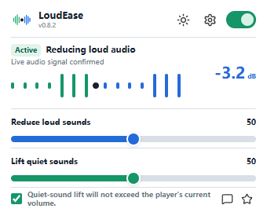
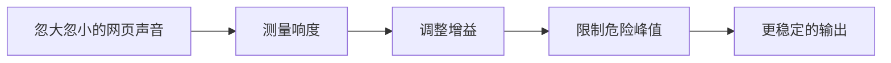
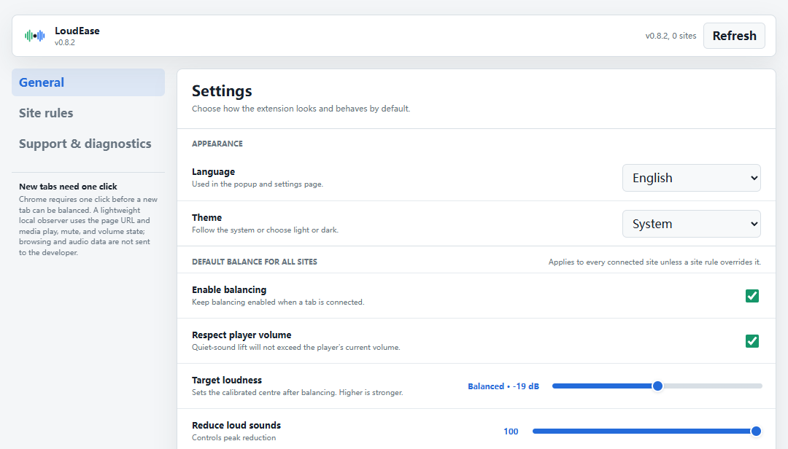

<p align="center">
  <picture>
    <source media="(prefers-color-scheme: dark)" srcset="assets/logo-ai-a-dark.png">
    
  </picture>
</p>

<h1 align="center">LoudEase</h1>

<p align="center"><strong>压住突兀的大声，保留该有的细节，把控制权留给你。</strong></p>

<p align="center">
  LoudEase 自动收窄网页音频中让人不舒服的响度落差，<br>
  同时始终尊重播放器音量和静音状态。
</p>

<p align="center">
  <a href="https://github.com/WSL043/loudease/actions/workflows/ci.yml"></a>
  
  
  
  <a href="LICENSE"></a>
</p>

<p align="center">
  <a href="README.md">English</a> ·
  <a href="#安装私有测试版">安装</a> ·
  <a href="#它如何工作">工作原理</a> ·
  <a href="#一起完善-loudease">社区测试</a> ·
  <a href="CONTRIBUTING.md">参与贡献</a> ·
  <a href="SUPPORT.md">支持</a>
</p>

<p align="center">
  <picture>
    <source media="(prefers-color-scheme: dark)" srcset="docs/popup-screenshot-dark.png">
    
  </picture>
</p>

> [!NOTE]
> LoudEase 目前仍是私有 Beta。下面会明确区分已经验证的行为和等待社区验证的目标，不把测试计划写成兼容承诺。

## 把网页声音收进更舒服的范围

网页音频很少遵守同一个舒适音量：对白听不清，音效突然冲出来，广告偏响，切换创作者或直播间后又要重新调音量。普通音量条只能让所有声音一起变化；LoudEase 处理的是不同声音时刻之间的落差。

| 压住突兀的大声 | 安全提起小声细节 | 尊重原有控制 |
|---|---|---|
| 快速增益衰减与前视限幅共同接住持续大声和短促峰值。 | 只有真实信号、峰值余量和所选强度都允许时才提升，不盲目放大底噪。 | 静音和播放器零音量始终是硬边界；只有收到新鲜运行证据时，界面才显示“生效中”。 |

LoudEase 不是音量放大器、均衡器，也不是经过校准的听力保护设备。它会缩小干扰听感的音量差，同时保留必要的层次和瞬态。

## 它如何工作



用户授权后，LoudEase 会把标签页作为一条完整音频流捕获，并在本机 `AudioWorklet` 中处理。K-weighted 测量分别驱动“压大声”和“提小声”，前视限幅器负责保护峰值余量，原始音频不会上传。

实现细节、算法假设和当前缺口见 [声音算法](docs/AUDIO_DSP.md)、[架构](docs/ARCHITECTURE.md) 与 [已知限制](docs/KNOWN_LIMITATIONS.md)。

## 安装私有测试版

需要 Chrome 116+、Node.js 20+。

```bash
git clone https://github.com/WSL043/loudease.git
cd loudease
npm install
npm run build:dev
```

打开 `chrome://extensions`，启用“开发者模式”，选择“加载已解压的扩展程序”，然后选择 `dist/github-dev`。

1. 打开正在播放声音的普通 `http` 或 `https` 网页。
2. 点击一次 LoudEase，为当前标签页授权。
3. 波形开始移动且出现实时 dB 数值，才表示正在处理。
4. 只有默认听感不合适时，再调整“压大声”和“提小声”。

Chrome 要求 `tabCapture` 由用户手势启动，因此全新标签页不能静默接管；完成授权后，即使切换到其他标签页，LoudEase 仍可继续处理原标签页。

## 已验证范围

| 证据 | 当前范围 |
|---|---|
| 私有 Beta 基线 | YouTube 视频/直播、Bilibili 视频/直播、抖音视频/直播 |
| 自动回归 | HTML5 媒体、SPA 换源、iframe、Web Audio、静音、播放器零音量、滑块持久化和离线 DSP 音频图 |
| 社区测试目标 | Twitch、TikTok、Spotify Web Player、Vimeo、社交视频、地区平台和受保护流媒体 |

测试目标不是兼容承诺。Chrome 内部页面以及 Chrome 拒绝捕获的页面不受支持。详见 [站点适配](docs/SITE_ADAPTERS.md) 和 [测试矩阵](docs/TEST_MATRIX.md)。

界面目前提供阿拉伯语、德语、英语、西班牙语、法语、日语、韩语、巴西葡萄牙语、俄语、简体中文和繁体中文，默认语言为英语。

## 一起完善 LoudEase

不需要任何一个人测完所有平台，也不要求每位测试者都跑两小时稳定性测试。范围小、可以复现的检查更有价值：

- 用 10 分钟检查一个网站的接管、换源、静音、播放器音量和标签页切换；
- 选择一段人声、音乐、直播或强瞬态内容，对比开启和关闭后的听感；
- 审阅一种自己日常使用的语言；
- 提交一个范围清晰、带回归测试的修复。

先阅读 [社区测试指南](docs/COMMUNITY_TESTING.md)，再通过 [问题选择器](https://github.com/WSL043/loudease/issues/new/choose) 提交兼容性、音质、Bug 或产品反馈。所有报告都由用户主动提交，扩展没有自动遥测服务。

官方项目由 WSL043 单独维护。问题与建议通过 [支持](SUPPORT.md) 中的 GitHub Issue Form 提交；项目边界见 [治理](GOVERNANCE.md)。

<details>
<summary><strong>当前设置与站点规则</strong></summary>
<br>
<p align="center">
  <picture>
    <source media="(prefers-color-scheme: dark)" srcset="docs/settings-screenshot-dark.png">
    
  </picture>
</p>
</details>

## 开发与验证

```bash
npm test              # 契约、DSP 与离线音频图测试
npm run test:dsp      # DSP 专项验证
npm run test:slider   # 弹窗滑块持久化回归
npm run test:release  # Chrome 商店精简构建验证
npm run audit         # 发布就绪证据审查
```

`dist/github-dev` 保留默认关闭的贡献者诊断；`dist/store` 通过白名单构建移除 localhost 权限、诊断界面、符号和网络代码。修改权限或打包逻辑前请阅读 [构建说明](docs/BUILD.md)。

公开 Beta 与商店发布门槛统一记录在基于证据的 [发布就绪审查](docs/RELEASE_READINESS_REVIEW.md) 中。

## 隐私、安全与许可

- 音频只存在于本机扩展音频图中。
- 不包含广告分析、静默遥测或远程可执行代码。
- 设置使用 `chrome.storage.sync`，同步行为取决于用户的 Chrome Sync 配置。
- LoudEase 无法控制系统增益、硬件放大或耳边实际声压。

详见 [隐私说明](PRIVACY.md)、[反馈与数据边界](docs/FEEDBACK.md) 和 [安全说明](SECURITY.md)。

源代码使用 [GPL-3.0-only](LICENSE)。对外分发的衍生版本必须按照 GPLv3 提供对应源码；已经通过历史 Beta 标签分发的副本继续适用当时附带的许可证，即使相应预发布记录或标签以后从 GitHub 移除也不会撤销。LoudEase 名称与 Logo 由 [商标政策](TRADEMARKS.md) 单独管理，内置图标的许可见 [第三方声明](THIRD_PARTY_NOTICES.md)。

许可证选择和历史边界见 [许可说明](docs/LICENSING.md)。项目管理权与贡献规则见 [治理说明](GOVERNANCE.md)、[贡献指南](CONTRIBUTING.md) 和 [开发者原创声明](DCO)；素材来源与机器可读许可边界见 [资产来源](ASSET_PROVENANCE.md) 和 [REUSE.toml](REUSE.toml)。
